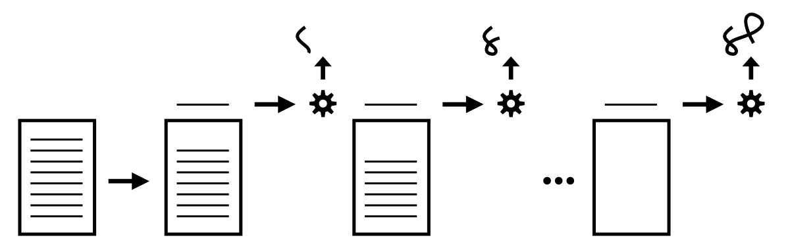
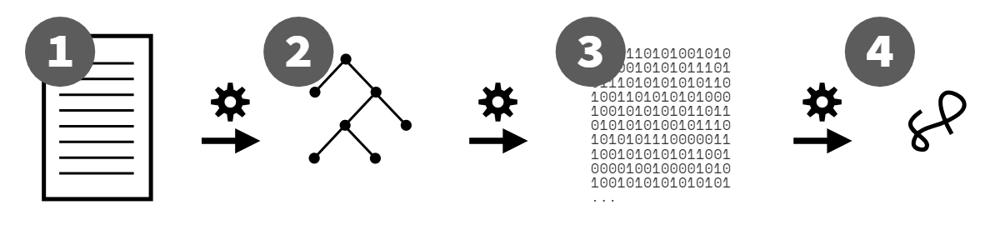

# Capítulo 1: ¿Qué *Es* JavaScript?

No conoces JS, todavía. Yo tampoco, al menos no completamente. Ninguno de nosotros lo hace. Pero todos podemos empezar a conocer mejor a JS.

En este primer capítulo del primer libro de la serie *You Don't Know JS Yet* (YDKJSY), dedicaremos tiempo a construir una base para avanzar. Necesitamos comenzar cubriendo una variedad de detalles importantes de mantenimiento, desmitificando algunos mitos y malentendidos sobre lo que realmente es el lenguaje (¡y lo que no es!).

Esta es una perspicacia valiosa sobre la identidad y el proceso de cómo está organizado y mantenido JS; todos los desarrolladores de JS deberían entenderlo. Si quieres conocer a JS, así es como *comenzar* dando los primeros pasos en ese viaje.

## Sobre Este Libro

Enfatizo la palabra viaje porque *conocer JS* no es un destino, es una dirección. No importa cuánto tiempo pases con el lenguaje, siempre podrás encontrar algo más que aprender y entender un poco mejor. Así que no veas este libro como algo para apresurarte y lograr un logro rápido. En cambio, la paciencia y la persistencia son lo mejor mientras das estos primeros pasos.

Después de este capítulo introductorio, el resto del libro presenta un mapa de alto nivel de lo que encontrarás mientras profundizas y estudias JS con los libros de YDKJSY.

En particular, el Capítulo 4 identifica tres pilares principales alrededor de los cuales está organizado el lenguaje JS: scope/closures (alcance/cierres), prototypes/objects (prototipos/objetos) y types/coercion (tipos/coerción). JS es un lenguaje amplio y sofisticado, con muchas características y capacidades. Pero todo JS se basa en estos tres pilares fundamentales.

Ten en cuenta que, aunque este libro tiene el título "Get Started", **no está destinado como un libro para principiantes o una introducción**. El trabajo principal de este libro es prepararte para estudiar JS en profundidad a lo largo del resto de la serie; está escrito asumiendo que ya tienes familiaridad con JS y al menos varios meses de experiencia antes de avanzar en YDKJSY. Entonces, para aprovechar al máximo *Get Started*, asegúrate de pasar mucho tiempo escribiendo código JS para acumular experiencia.

Incluso si ya has escrito mucho JS antes, este libro no debe pasarse por alto o saltarse; tómate tu tiempo para procesar completamente el material aquí. **Un buen comienzo siempre depende de un primer paso sólido.**

## ¿Qué significa ese nombre?

El nombre JavaScript es probablemente el nombre de un lenguaje de programación más malinterpretado y comprendido.

¿Está este lenguaje relacionado con Java? ¿Es solo la forma de script para Java? ¿Solo sirve para escribir scripts y no programas reales?

La verdad es que el nombre JavaScript es un resultado de artimañas de marketing. Cuando Brendan Eich concibió por primera vez el lenguaje, lo denominó Mocha. Internamente en Netscape, se utilizaba la marca LiveScript. Pero cuando llegó el momento de nombrar públicamente el lenguaje, "JavaScript" ganó la votación.

¿Por qué? Porque este lenguaje fue diseñado originalmente para atraer a una audiencia compuesta en su mayoría por programadores de Java, y porque la palabra "script" estaba de moda en ese momento para referirse a programas livianos. Estos "scripts" livianos serían los primeros en incrustarse en páginas en esta nueva cosa llamada web!

En otras palabras, JavaScript fue un truco de marketing para tratar de posicionar este lenguaje como una alternativa aceptable para escribir el más pesado y más conocido Java de la época. Podría haberse llamado igualmente "WebJava", por así decirlo.

Existen algunas similitudes superficiales entre el código de JavaScript y el código de Java. Esas similitudes no provienen especialmente de un desarrollo compartido, sino porque ambos lenguajes apuntan a desarrolladores con expectativas de sintaxis asumidas de C (y en cierta medida, C++).

Por ejemplo, usamos la `{` para comenzar un bloque de código y la `}` para finalizar ese bloque de código, al igual que en C/C++ y Java. También usamos el `;` para poner fin a una declaración.

De alguna manera, las relaciones legales van aún más allá de la sintaxis. Oracle (a través de Sun), la empresa que aún posee y opera Java, también posee la marca registrada oficial para el nombre "JavaScript" (a través de Netscape). Esta marca registrada casi nunca se hace valer y probablemente no podría hacerse en este momento.

Por estas razones, algunos han sugerido que usemos JS en lugar de JavaScript. Esa es una abreviatura muy común, aunque no es un buen candidato para la marca oficial del lenguaje. De hecho, estos libros utilizan JS casi exclusivamente para referirse al lenguaje.

Para distanciar aún más al lenguaje de la marca registrada propiedad de Oracle, el nombre oficial del lenguaje especificado por TC39 y formalizado por el organismo de normas ECMA es **ECMAScript**. Y de hecho, desde 2016, el nombre oficial del lenguaje también ha sido seguido por el año de revisión; al momento de escribir esto, eso es ECMAScript 2019, o de lo contrario abreviado como ES2019.

En otras palabras, el JavaScript/JS que se ejecuta en tu navegador o en Node.js, es *una* implementación del estándar ES2019.

| NOTA: |
| :--- |
| No uses términos como "JS6" o "ES8" para referirte al lenguaje. Algunos lo hacen, pero esos términos solo sirven para perpetuar la confusión. "ES20xx" o simplemente "JS" son los términos a los que debes ceñirte. |

Ya sea que lo llames JavaScript, JS, ECMAScript o ES2019, ¡definitivamente no es una variante del lenguaje Java!

> "Java es a JavaScript como jamón es a hámster." --Jeremy Keith, 2009

## Especificación del Lenguaje.

Mencioné TC39, el comité de dirección técnica que gestiona JS. Su tarea principal es gestionar la especificación oficial del lenguaje. Se reúnen regularmente para votar sobre cualquier cambio acordado, que luego envían a ECMA, la organización de estándares.

La sintaxis y el comportamiento de JS están definidos en la especificación ES.

ES2019 resulta ser la décima especificación/revisión numerada principal desde el inicio de JS en 1995, así que en la URL oficial de la especificación alojada por ECMA, encontrarás "10.0":

https://www.ecma-international.org/ecma-262/10.0/

El comité TC39 está compuesto por entre 50 y aproximadamente 100 personas de una amplia variedad de empresas relacionadas con la web, como fabricantes de navegadores (Mozilla, Google, Apple) y fabricantes de dispositivos (Samsung, etc). Todos los miembros del comité son voluntarios, aunque muchos de ellos son empleados de estas empresas y pueden recibir compensación en parte por sus funciones en el comité.

TC39 se reúne generalmente aproximadamente cada dos meses, por lo general durante unos tres días, para revisar el trabajo realizado por los miembros desde la última reunión, discutir problemas y votar sobre propuestas. Las ubicaciones de las reuniones rotan entre las empresas miembros dispuestas a ser anfitrionas.

Todas las propuestas de TC39 avanzan a través de un proceso de cinco etapas, por supuesto, ya que somos programadores, ¡comienza en 0! Desde la Etapa 0 hasta la Etapa 4. Puedes obtener más información sobre el proceso de etapas aquí: https://tc39.es/process-document/

La Etapa 0 significa aproximadamente que alguien en TC39 piensa que es una idea valiosa y planea respaldarla y trabajar en ella. Eso significa que muchas ideas que los no miembros de TC39 "proponen", a través de medios informales como las redes sociales o publicaciones en blogs, son realmente "pre-etapa 0". Debes conseguir que un miembro de TC39 respalde una propuesta para que sea considerada oficialmente "Etapa 0".

Una vez que una propuesta alcanza el estado de "Etapa 4", es elegible para ser incluida en la próxima revisión anual del lenguaje. Puede tomar desde varios meses hasta unos pocos años para que una propuesta avance a través de estas etapas.

Todas las propuestas se gestionan de manera abierta, en el repositorio de Github de TC39: https://github.com/tc39/proposals

Cualquier persona, ya sea miembro de TC39 o no, puede participar en estas discusiones públicas y en los procesos para trabajar en las propuestas. Sin embargo, solo los miembros de TC39 pueden asistir a las reuniones y votar sobre las propuestas y los cambios. Por lo tanto, en efecto, la voz de un miembro de TC39 tiene mucho peso en la dirección que tomará JS.

Contrariamente a algún mito establecido y frustrantemente perpetuado, *no* hay múltiples versiones de JavaScript en circulación. Solo existe **un JS**, el estándar oficial mantenido por TC39 y ECMA.

En la década de los 2000s, cuando Microsoft mantenía una versión bifurcada e ingenierizada en reversa (y no del todo compatible) de JS llamada "JScript", realmente existían "versiones múltiples" de JS. Pero esos días han quedado atrás. Es obsoleto y inexacto hacer tales afirmaciones sobre JS hoy en día.

Todos los principales navegadores y fabricantes de dispositivos se han comprometido a mantener sus implementaciones de JS compatibles con esta única especificación central. Por supuesto, los motores implementan características en diferentes momentos. Pero nunca debería ser el caso de que el motor V8 (el motor JS de Chrome) implemente una característica especificada de manera diferente o incompatible en comparación con el motor SpiderMonkey (el motor JS de Mozilla).

Esto significa que puedes aprender un **solo JS** y confiar en ese mismo JS en todas partes.

### La Web Lo Gobierna Todo (JS)

Mientras que la variedad de entornos que ejecutan JS está en constante expansión (desde navegadores, hasta servidores (Node.js), pasando por robots, bombillas, hasta...), el único entorno que domina JS es la web. En otras palabras, cómo se implementa JS para los navegadores web es, en la práctica, la única realidad que importa.

En su mayor parte, el JS definido en la especificación y el JS que se ejecuta en los motores de JS basados en el navegador es el mismo. Pero hay algunas diferencias que deben tenerse en cuenta.

A veces, la especificación de JS dictará algún comportamiento nuevo o refinado, y aún así, eso no coincidirá exactamente con cómo funciona en los motores de JS basados en el navegador. Tal desajuste es histórico: los motores de JS han tenido más de 20 años de comportamientos observables en casos particulares de características en las que el contenido web ha llegado a depender. Como tal, a veces los motores de JS se negarán a conformarse a un cambio dictado por la especificación porque rompería ese contenido web.

En estos casos, a menudo TC39 retrocederá y simplemente elegirá ajustar la especificación a la realidad de la web. Por ejemplo, TC39 planeaba agregar un método `contains(..)` para Arrays, pero se descubrió que este nombre entraba en conflicto con antiguos frameworks de JS que aún se utilizan en algunos sitios, así que cambiaron el nombre a un `includes(..)` que no tenía conflictos. Lo mismo ocurrió con una cómica/trágica *crisis comunitaria* de JS llamada "smooshgate", donde el método planeado `flatten(..)` fue finalmente renombrado a `flat(..)`.

Pero ocasionalmente, TC39 decidirá que la especificación debe mantenerse firme en algún punto, aunque es poco probable que los motores de JS basados en el navegador se conformen.

¿La solución? Apéndice B, "Características Adicionales de ECMAScript para Navegadores Web".[^specApB] La especificación de JS incluye este apéndice para detallar cualquier desajuste conocido entre la especificación oficial de JS y la realidad de JS en la web. En otras palabras, estas son excepciones permitidas *solo* para JS web; otros entornos de JS deben ceñirse al pie de la letra de la ley.

La Sección B.1 y B.2 cubren *adiciones* a JS (sintaxis y APIs) que JS web incluye, nuevamente por razones históricas, pero que TC39 no planea especificar formalmente en el núcleo de JS. Ejemplos incluyen literales octales con prefijo `0`, las utilidades globales `escape(..)` / `unescape(..)`, "helpers" de String como `anchor(..)` y `blink()`, y el método `compile(..)` de RegExp.

La Sección B.3 incluye algunos conflictos donde el código puede ejecutarse tanto en motores de JS web como en motores de JS no web, pero donde el comportamiento *podría* ser observadamente diferente, entregando resultados diferentes. La mayoría de los cambios enumerados involucran situaciones etiquetadas como errores tempranos cuando el código se ejecuta en modo estricto.

No se encuentran *problemas* del Apéndice B muy a menudo, pero aún así es buena idea evitar estas construcciones para estar a salvo en el futuro. Siempre que sea posible, adhiérete a la especificación de JS y no confíes en comportamientos que solo son aplicables en ciertos entornos de motores de JS.

### No Todo JS (Web)...

¿Es este código un programa de JS?

```js
alert("Hello, JS!");
```

Depende de cómo lo veas. La función `alert(..)` mostrada aquí no está incluida en la especificación de JS, pero sí *está* en todos los entornos web de JS. Sin embargo, no la encontrarás en el Apéndice B, ¿entonces qué pasa?

Varios entornos de JS (como los motores de JS de los navegadores, Node.js, etc.) añaden APIs al ámbito global de tus programas de JS que te proporcionan capacidades específicas del entorno, como la capacidad de mostrar una ventana de alerta en el navegador del usuario.

De hecho, una amplia variedad de APIs que se parecen a JS, como `fetch(..)`, `getCurrentLocation(..)`, y `getUserMedia(..)`, son todas APIs web que parecen JS. En Node.js, podemos acceder a cientos de métodos de API de varios módulos integrados, como `fs.write(..)`.

Otro ejemplo común es `console.log(..)` (¡y todos los demás métodos de `console.*` !). Estos no están especificados en JS, pero debido a su utilidad universal, son definidos por prácticamente todos los entornos de JS, según un consenso aproximado.

Entonces, `alert(..)` y `console.log(..)` no están definidos por JS. Pero *parecen* JS. Son funciones y métodos de objetos y siguen las reglas de sintaxis de JS. Los comportamientos detrás de ellos son controlados por el entorno que ejecuta el motor de JS, pero en la superficie definitivamente tienen que cumplir con JS para poder jugar en el patio de juegos de JS.

La mayoría de las diferencias entre navegadores de las que la gente se queja con afirmaciones como "¡JS es tan inconsistente!" son en realidad debidas a diferencias en cómo funcionan esos comportamientos del entorno, no en cómo funciona el propio JS.

Entonces, una llamada a `alert(..)` *es* JS, pero `alert` en sí mismo es realmente solo un invitado, no parte de la especificación oficial de JS.

### No siempre es JS

Usar la consola/REPL (Read-Evaluate-Print-Loop) en las Herramientas para Desarrolladores de tu navegador (o en Node) parece ser un entorno de JS bastante directo a primera vista. Pero en realidad no lo es.

Las Herramientas para Desarrolladores son... herramientas para desarrolladores. Su propósito principal es hacer la vida más fácil para los desarrolladores. Priorizan la DX (Experiencia del Desarrollador). *No* es una meta de tales herramientas reflejar con precisión y purismo todas las sutilezas del comportamiento estricto de JS. Como tal, hay muchas peculiaridades que pueden actuar como "trampas" si estás tratando la consola como un entorno de JS *puro*.

Esta conveniencia es algo bueno, ¡por cierto! Me alegra que las Herramientas para Desarrolladores faciliten la vida de los desarrolladores. Me alegra que tengamos encantos de UX agradables como el autocompletado de variables/propiedades, etc. Solo estoy señalando que no podemos ni debemos esperar que tales herramientas se adhieran *siempre* estrictamente a la manera en que se manejan los programas de JS, porque ese no es el propósito de estas herramientas.

Dado que tales herramientas varían en comportamiento de un navegador a otro, y dado que cambian (a veces bastante frecuentemente), no voy a "codificar" específicamente detalles en este texto, asegurando así que el texto de este libro esté desactualizado rápidamente.

Pero solo daré algunas pistas de ejemplos de peculiaridades que han sido verdaderas en varios momentos en diferentes entornos de consolas de JS, para reforzar mi punto acerca de no asumir el comportamiento nativo de JS mientras las usas:

* Si una declaración `var` o `function` en el "ámbito global" superior de la consola realmente crea una variable global real (¡y una propiedad `window` reflejada, y viceversa!).

* Qué sucede con múltiples declaraciones `let` y `const` en el "ámbito global" superior.

* Si `"use strict";` en una entrada de una sola línea (presionar `<enter>` después) habilita el modo estricto para el resto de esa sesión de consola, de la misma manera que lo haría en la primera línea de un archivo .js, y también si puedes usar `"use strict";` más allá de la "primera línea" y aún así activar el modo estricto para esa sesión.

* Cómo funciona el enlace predeterminado de `this` en el modo no estricto para las llamadas de funciones, y si el "objeto global" utilizado contendrá las variables globales esperadas.

* Cómo funciona el izado (consulte el Libro 2, *Scope & Closures*) en múltiples entradas de líneas.

* ...varias otras

La consola del desarrollador no está tratando de fingir ser un compilador de JS que maneje tu código ingresado exactamente de la misma manera que el motor de JS maneja un archivo .js. Está tratando de facilitarte la entrada rápida de unas pocas líneas de código y ver los resultados de inmediato. Estos son casos de uso completamente diferentes, y como tal, es irrazonable esperar que una herramienta maneje ambos de manera equitativa.

No confíes en el comportamiento que ves en una consola de desarrollador como que representa la semántica *exacta* de JS al pie de la letra; para eso, lee la especificación. En cambio, piensa en la consola como un entorno "amigable con JS". Eso es útil por sí mismo.

## Many Faces

The term "paradigm" in programming language context refers to a broad (almost universal) mindset and approach to structuring code. Within a paradigm, there are myriad variations of style and form that distinguish programs, including countless different libraries and frameworks that leave their unique signature on any given code.

But no matter what a program's individual style may be, the big picture divisions around paradigms are almost always evident at first glance of any program.

Typical paradigm-level code categories include procedural, object-oriented (OO/classes), and functional (FP):

* Procedural style organizes code in a top-down, linear progression through a pre-determined set of operations, usually collected together in related units called procedures.

* OO style organizes code by collecting logic and data together into units called classes.

* FP style organizes code into functions (pure computations as opposed to procedures), and the adaptations of those functions as values.

Paradigms are neither right nor wrong. They're orientations that guide and mold how programmers approach problems and solutions, how they structure and maintain their code.

Some languages are heavily slanted toward one paradigm—C is procedural, Java/C++ are almost entirely class oriented, and Haskell is FP through and through.

But many languages also support code patterns that can come from, and even mix and match from, different paradigms. So called "multi-paradigm languages" offer ultimate flexibility. In some cases, a single program can even have two or more expressions of these paradigms sitting side by side.

JavaScript is most definitely a multi-paradigm language. You can write procedural, class-oriented, or FP-style code, and you can make those decisions on a line-by-line basis instead of being forced into an all-or-nothing choice.

## Backwards & Forwards

One of the most foundational principles that guides JavaScript is preservation of *backwards compatibility*. Many are confused by the implications of this term, and often confuse it with a related but different term: *forwards compatibility*.

Let's set the record straight.

Backwards compatibility means that once something is accepted as valid JS, there will not be a future change to the language that causes that code to become invalid JS. Code written in 1995—however primitive or limited it may have been!—should still work today. As TC39 members often proclaim, "we don't break the web!"

The idea is that JS developers can write code with confidence that their code won't stop working unpredictably because a browser update is released. This makes the decision to choose JS for a program a more wise and safe investment, for years into the future.

That "guarantee" is no small thing. Maintaining backwards compatibility, stretched out across almost 25 years of the language's history, creates an enormous burden and a whole slew of unique challenges. You'd be hard pressed to find many other examples in computing of such a commitment to backwards compatibility.

The costs of sticking to this principle should not be casually dismissed. It necessarily creates a very high bar to including changing or extending the language; any decision becomes effectively permanent, mistakes and all. Once it's in JS, it can't be taken out because it might break programs, even if we'd really, really like to remove it!

There are some small exceptions to this rule. JS has had some backwards-incompatible changes, but TC39 is extremely cautious in doing so. They study existing code on the web (via browser data gathering) to estimate the impact of such breakage, and browsers ultimately decide and vote on whether they're willing to take the heat from users for a very small-scale breakage weighed against the benefits of fixing or improving some aspect of the language for many more sites (and users).

These kinds of changes are rare, and are almost always in corner cases of usage that are unlikely to be observably breaking in many sites.

Compare *backwards compatibility* to its counterpart, *forwards compatibility*. Being forwards-compatible means that including a new addition to the language in a program would not cause that program to break if it were run in an older JS engine. **JS is not forwards-compatible**, despite many wishing such, and even incorrectly believing the myth that it is.

HTML and CSS, by contrast, are forwards-compatible but not backwards-compatible. If you dug up some HTML or CSS written back in 1995, it's entirely possible it would not work (or work the same) today. But, if you use a new feature from 2019 in a browser from 2010, the page isn't "broken" -- the unrecognized CSS/HTML is skipped over, while the rest of the CSS/HTML would be processed accordingly.

It may seem desirable for forwards-compatibility to be included in programming language design, but it's generally impractical to do so. Markup (HTML) or styling (CSS) are declarative in nature, so it's much easier to "skip over" unrecognized declarations with minimal impact to other recognized declarations.

But chaos and non-determinism would ensue if a programming language engine selectively skipped statements (or even expressions!) that it didn't understand, as it's impossible to ensure that a subsequent part of the program wasn't expecting the skipped-over part to have been processed.

Though JS isn't, and can't be, forwards-compatible, it's critical to recognize JS's backwards compatibility, including the enduring benefits to the web and the constraints and difficulties it places on JS as a result.

### Jumping the Gaps

Since JS is not forwards-compatible, it means that there is always the potential for a gap between code that you can write that's valid JS, and the oldest engine that your site or application needs to support. If you run a program that uses an ES2019 feature in an engine from 2016, you're very likely to see the program break and crash.

If the feature is a new syntax, the program will in general completely fail to compile and run, usually throwing a syntax error. If the feature is an API (such as ES6's `Object.is(..)`), the program may run up to a point but then throw a runtime exception and stop once it encounters the reference to the unknown API.

Does this mean JS developers should always lag behind the pace of progress, using only code that is on the trailing edge of the oldest JS engine environments they need to support? No!

But it does mean that JS developers need to take special care to address this gap.

For new and incompatible syntax, the solution is transpiling. Transpiling is a contrived and community-invented term to describe using a tool to convert the source code of a program from one form to another (but still as textual source code). Typically, forwards-compatibility problems related to syntax are solved by using a transpiler (the most common one being Babel (https://babeljs.io)) to convert from that newer JS syntax version to an equivalent older syntax.

For example, a developer may write a snippet of code like:

```js
if (something) {
    let x = 3;
    console.log(x);
}
else {
    let x = 4;
    console.log(x);
}
```

This is how the code would look in the source code tree for that application. But when producing the file(s) to deploy to the public website, the Babel transpiler might convert that code to look like this:

```js
var x$0, x$1;
if (something) {
    x$0 = 3;
    console.log(x$0);
}
else {
    x$1 = 4;
    console.log(x$1);
}
```

The original snippet relied on `let` to create block-scoped `x` variables in both the `if` and `else` clauses which did not interfere with each other. An equivalent program (with minimal re-working) that Babel can produce just chooses to name two different variables with unique names, producing the same non-interference outcome.

| NOTE: |
| :--- |
| The `let` keyword was added in ES6 (in 2015). The preceding example of transpiling would only need to apply if an application needed to run in a pre-ES6 supporting JS environment. The example here is just for simplicity of illustration. When ES6 was new, the need for such a transpilation was quite prevalent, but in 2020 it's much less common to need to support pre-ES6 environments. The "target" used for transpiliation is thus a sliding window that shifts upward only as decisions are made for a site/application to stop supporting some old browser/engine. |

You may wonder: why go to the trouble of using a tool to convert from a newer syntax version to an older one? Couldn't we just write the two variables and skip using the `let` keyword? The reason is, it's strongly recommended that developers use the latest version of JS so that their code is clean and communicates its ideas most effectively.

Developers should focus on writing the clean, new syntax forms, and let the tools take care of producing a forwards-compatible version of that code that is suitable to deploy and run on the oldest-supported JS engine environments.

### Filling the Gaps

If the forwards-compatibility issue is not related to new syntax, but rather to a missing API method that was only recently added, the most common solution is to provide a definition for that missing API method that stands in and acts as if the older environment had already had it natively defined. This pattern is called a polyfill (aka "shim").

Consider this code:

```js
// getSomeRecords() returns us a promise for some
// data it will fetch
var pr = getSomeRecords();

// show the UI spinner while we get the data
startSpinner();

pr
.then(renderRecords)   // render if successful
.catch(showError)      // show an error if not
.finally(hideSpinner)  // always hide the spinner
```

This code uses an ES2019 feature, the `finally(..)` method on the promise prototype. If this code were used in a pre-ES2019 environment, the `finally(..)` method would not exist, and an error would occur.

A polyfill for `finally(..)` in pre-ES2019 environments could look like this:

```js
if (!Promise.prototype.finally) {
    Promise.prototype.finally = function f(fn){
        return this.then(
            function t(v){
                return Promise.resolve( fn() )
                    .then(function t(){
                        return v;
                    });
            },
            function c(e){
                return Promise.resolve( fn() )
                    .then(function t(){
                        throw e;
                    });
            }
        );
    };
}
```

| WARNING: |
| :--- |
| This is only a simple illustration of a basic (not entirely spec-compliant) polyfill for `finally(..)`. Don't use this polyfill in your code; always use a robust, official polyfill wherever possible, such as the collection of polyfills/shims in ES-Shim. |

The `if` statement protects the polyfill definition by preventing it from running in any environment where the JS engine has already defined that method. In older environments, the polyfill is defined, but in newer environments the `if` statement is quietly skipped.

Transpilers like Babel typically detect which polyfills your code needs and provide them automatically for you. But occasionally you may need to include/define them explicitly, which works similar to the snippet we just looked at.

Always write code using the most appropriate features to communicate its ideas and intent effectively. In general, this means using the most recent stable JS version. Avoid negatively impacting the code's readability by trying to manually adjust for the syntax/API gaps. That's what tools are for!

Transpilation and polyfilling are two highly effective techniques for addressing that gap between code that uses the latest stable features in the language and the old environments a site or application needs to still support. Since JS isn't going to stop improving, the gap will never go away. Both techniques should be embraced as a standard part of every JS project's production chain going forward.

## What's in an Interpretation?

A long-debated question for code written in JS: is it an interpreted script or a compiled program? The majority opinion seems to be that JS is an interpreted (scripting) language. But the truth is more complicated than that.

For much of the history of programming languages, "interpreted" languages and "scripting" languages have been looked down on as inferior compared to their compiled counterparts. The reasons for this acrimony are numerous, including the perception that there is a lack of performance optimization, as well as dislike of certain language characteristics, such as scripting languages generally using dynamic typing instead of the "more mature" statically typed languages.

Languages regarded as "compiled" usually produce a portable (binary) representation of the program that is distributed for execution later. Since we don't really observe that kind of model with JS (we distribute the source code, not the binary form), many claim that disqualifies JS from the category. In reality, the distribution model for a program's "executable" form has become drastically more varied and also less relevant over the last few decades; to the question at hand, it doesn't really matter so much anymore what form of a program gets passed around.

These misinformed claims and criticisms should be set aside. The real reason it matters to have a clear picture on whether JS is interpreted or compiled relates to the nature of how errors are handled.

Historically, scripted or interpreted languages were executed in generally a top-down and line-by-line fashion; there's typically not an initial pass through the program to process it before execution begins (see Figure 1).

<figure>
    
    <figcaption><em>Fig. 1: Interpreted/Scripted Execution</em></figcaption>
    <br><br>
</figure>

In scripted or interpreted languages, an error on line 5 of a program won't be discovered until lines 1 through 4 have already executed. Notably, the error on line 5 might be due to a runtime condition, such as some variable or value having an unsuitable value for an operation, or it may be due to a malformed statement/command on that line. Depending on context, deferring error handling to the line the error occurs on may be a desirable or undesirable effect.

Compare that to languages which do go through a processing step (typically, called parsing) before any execution occurs, as illustrated in Figure 2:

<figure>
    
    <figcaption><em>Fig. 2: Parsing + Compilation + Execution</em></figcaption>
    <br><br>
</figure>

In this processing model, an invalid command (such as broken syntax) on line 5 would be caught during the parsing phase, before any execution has begun, and none of the program would run. For catching syntax (or otherwise "static") errors, generally it's preferred to know about them ahead of any doomed partial execution.

So what do "parsed" languages have in common with "compiled" languages? First, all compiled languages are parsed. So a parsed language is quite a ways down the road toward being compiled already. In classic compilation theory, the last remaining step after parsing is code generation: producing an executable form.

Once any source program has been fully parsed, it's very common that its subsequent execution will, in some form or fashion, include a translation from the parsed form of the program—usually called an Abstract Syntax Tree (AST)—to that executable form.

In other words, parsed languages usually also perform code generation before execution, so it's not that much of a stretch to say that, in spirit, they're compiled languages.

JS source code is parsed before it is executed. The specification requires as much, because it calls for "early errors"—statically determined errors in code, such as a duplicate parameter name—to be reported before the code starts executing. Those errors cannot be recognized without the code having been parsed.

So **JS is a parsed language**, but is it *compiled*?

The answer is closer to yes than no. The parsed JS is converted to an optimized (binary) form, and that "code" is subsequently executed (Figure 2); the engine does not commonly switch back into line-by-line execution (like Figure 1) mode after it has finished all the hard work of parsing—most languages/engines wouldn't, because that would be highly inefficient.

To be specific, this "compilation" produces a binary byte code (of sorts), which is then handed to the "JS virtual machine" to execute. Some like to say this VM is "interpreting" the byte code. But then that means Java, and a dozen other JVM-driven languages, for that matter, are interpreted rather than compiled. Of course, that contradicts the typical assertion that Java/etc are compiled languages.

Interestingly, while Java and JavaScript are very different languages, the question of interpreted/compiled is pretty closely related between them!

Another wrinkle is that JS engines can employ multiple passes of JIT (Just-In-Time) processing/optimization on the generated code (post parsing), which again could reasonably be labeled either "compilation" or "interpretation" depending on perspective. It's actually a fantastically complex situation under the hood of a JS engine.

So what do these nitty-gritty details boil down to? Step back and consider the entire flow of a JS source program:

1. After a program leaves a developer's editor, it gets transpiled by Babel, then packed by Webpack (and perhaps half a dozen other build processes), then it gets delivered in that very different form to a JS engine.

2. The JS engine parses the code to an AST.

3. Then the engine converts that AST to a kind-of byte code, a binary intermediate representation (IR), which is then refined/converted even further by the optimizing JIT compiler.

4. Finally, the JS VM executes the program.

To visualize those steps, again:

<figure>
    
    <figcaption><em>Fig. 3: Parsing, Compiling, and Executing JS</em></figcaption>
    <br><br>
</figure>

Is JS handled more like an interpreted, line-by-line script, as in Figure 1, or is it handled more like a compiled language that's processed in one-to-several passes first, before execution (as in Figures 2 and 3)?

I think it's clear that in spirit, if not in practice, **JS is a compiled language**.

And again, the reason that matters is, since JS is compiled, we are informed of static errors (such as malformed syntax) before our code is executed. That is a substantively different interaction model than we get with traditional "scripting" programs, and arguably more helpful!

### Web Assembly (WASM)

One dominating concern that has driven a significant amount of JS's evolution is performance, both how quickly JS can be parsed/compiled and how quickly that compiled code can be executed.

In 2013, engineers from Mozilla Firefox demonstrated a port of the Unreal 3 game engine from C to JS. The ability for this code to run in a browser JS engine at full 60fps performance was predicated on a set of optimizations that the JS engine could perform specifically because the JS version of the Unreal engine's code used a style of code that favored a subset of the JS language, named "ASM.js".

This subset is valid JS written in ways that are somewhat uncommon in normal coding, but which signal certain important typing information to the engine that allow it to make key optimizations. ASM.js was introduced as one way of addressing the pressures on the runtime performance of JS.

But it's important to note that ASM.js was never intended to be code that was authored by developers, but rather a representation of a program having been transpiled from another language (such as C), where these typing "annotations" were inserted automatically by the tooling.

Several years after ASM.js demonstrated the validity of tooling-created versions of programs that can be processed more efficiently by the JS engine, another group of engineers (also, initially, from Mozilla) released Web Assembly (WASM).

WASM is similar to ASM.js in that its original intent was to provide a path for non-JS programs (C, etc.) to be converted to a form that could run in the JS engine. Unlike ASM.js, WASM chose to additionally get around some of the inherent delays in JS parsing/compilation before a program can execute, by representing the program in a form that is entirely unlike JS.

WASM is a representation format more akin to Assembly (hence, its name) that can be processed by a JS engine by skipping the parsing/compilation that the JS engine normally does. The parsing/compilation of a WASM-targeted program happen ahead of time (AOT); what's distributed is a binary-packed program ready for the JS engine to execute with very minimal processing.

An initial motivation for WASM was clearly the potential performance improvements. While that continues to be a focus, WASM is additionally motivated by the desire to bring more parity for non-JS languages to the web platform. For example, if a language like Go supports threaded programming, but JS (the language) does not, WASM offers the potential for such a Go program to be converted to a form the JS engine can understand, without needing a threads feature in the JS language itself.

In other words, WASM relieves the pressure to add features to JS that are mostly/exclusively intended to be used by transpiled programs from other languages. That means JS feature development can be judged (by TC39) without being skewed by interests/demands in other language ecosystems, while still letting those languages have a viable path onto the web.

Another perspective on WASM that's emerging is, interestingly, not even directly related to the web (W). WASM is evolving to become a cross-platform virtual machine (VM) of sorts, where programs can be compiled once and run in a variety of different system environments.

So, WASM isn't only for the web, and WASM also isn't JS. Ironically, even though WASM runs in the JS engine, the JS language is one of the least suitable languages to source WASM programs with, because WASM relies heavily on static typing information. Even TypeScript (TS)—ostensibly, JS + static types—is not quite suitable (as it stands) to transpile to WASM, though language variants like AssemblyScript are attempting to bridge the gap between JS/TS and WASM.

This book isn't about WASM, so I won't spend much more time discussing it, except to make one final point. *Some* folks have suggested WASM points to a future where JS is excised from, or minimized in, the web. These folks often harbor ill feelings about JS, and want some other language—any other language!—to replace it. Since WASM lets other languages run in the JS engine, on its face this isn't an entirely fanciful fairytale.

But let me just state simply: WASM will not replace JS. WASM significantly augments what the web (including JS) can accomplish. That's a great thing, entirely orthogonal to whether some people will use it as an escape hatch from having to write JS.

## *Strict*ly Speaking

Back in 2009 with the release of ES5, JS added *strict mode* as an opt-in mechanism for encouraging better JS programs.

The benefits of strict mode far outweigh the costs, but old habits die hard and the inertia of existing (aka "legacy") code bases is really hard to shift. So sadly, more than 10 years later, strict mode's *optionality* means that it's still not necessarily the default for JS programmers.

Why strict mode? Strict mode shouldn't be thought of as a restriction on what you can't do, but rather as a guide to the best way to do things so that the JS engine has the best chance of optimizing and efficiently running the code. Most JS code is worked on by teams of developers, so the *strict*-ness of strict mode (along with tooling like linters!) often helps collaboration on code by avoiding some of the more problematic mistakes that slip by in non-strict mode.

Most strict mode controls are in the form of *early errors*, meaning errors that aren't strictly syntax errors but are still thrown at compile time (before the code is run). For example, strict mode disallows naming two function parameters the same, and results in an early error. Some other strict mode controls are only observable at runtime, such as how `this` defaults to `undefined` instead of the global object.

Rather than fighting and arguing with strict mode, like a kid who just wants to defy whatever their parents tell them not to do, the best mindset is that strict mode is like a linter reminding you how JS *should* be written to have the highest quality and best chance at performance. If you find yourself feeling handcuffed, trying to work around strict mode, that should be a blaring red warning flag that you need to back up and rethink the whole approach.

Strict mode is switched on per file with a special pragma (nothing allowed before it except comments/whitespace):

```js
// only whitespace and comments are allowed
// before the use-strict pragma
"use strict";
// the rest of the file runs in strict mode
```

| WARNING: |
| :--- |
| Something to be aware of is that even a stray `;` all by itself appearing before the strict mode pragma will render the pragma useless; no errors are thrown because it's valid JS to have a string literal expression in a statement position, but it also will silently *not* turn on strict mode! |

Strict mode can alternatively be turned on per-function scope, with exactly the same rules about its surroundings:

```js
function someOperations() {
    // whitespace and comments are fine here
    "use strict";

    // all this code will run in strict mode
}
```

Interestingly, if a file has strict mode turned on, the function-level strict mode pragmas are disallowed. So you have to pick one or the other.

The **only** valid reason to use a per-function approach to strict mode is when you are converting an existing non-strict mode program file and need to make the changes little by little over time. Otherwise, it's vastly better to simply turn strict mode on for the entire file/program.

Many have wondered if there would ever be a time when JS made strict mode the default? The answer is, almost certainly not. As we discussed earlier around backwards compatibility, if a JS engine update started assuming code was strict mode even if it's not marked as such, it's possible that this code would break as a result of strict mode's controls.

However, there are a few factors that reduce the future impact of this non-default "obscurity" of strict mode.

For one, virtually all transpiled code ends up in strict mode even if the original source code isn't written as such. Most JS code in production has been transpiled, so that means most JS is already adhering to strict mode. It's possible to undo that assumption, but you really have to go out of your way to do so, so it's highly unlikely.

Moreover, a wide shift is happening toward more/most new JS code being written using the ES6 module format. ES6 modules assume strict mode, so all code in such files is automatically defaulted to strict mode.

Taken together, strict mode is largely the de facto default even though technically it's not actually the default.

## Defined

JS is an implementation of the ECMAScript standard (version ES2019 as of this writing), which is guided by the TC39 committee and hosted by ECMA. It runs in browsers and other JS environments such as Node.js.

JS is a multi-paradigm language, meaning the syntax and capabilities allow a developer to mix and match (and bend and reshape!) concepts from various major paradigms, such as procedural, object-oriented (OO/classes), and functional (FP).

JS is a compiled language, meaning the tools (including the JS engine) process and verify a program (reporting any errors!) before it executes.

With our language now *defined*, let's start getting to know its ins and outs.

[^specApB]: ECMAScript 2019 Language Specification, Appendix B: Additional ECMAScript Features for Web Browsers, https://www.ecma-international.org/ecma-262/10.0/#sec-additional-ecmascript-features-for-web-browsers (la última versión disponible en el momento de escribir esto en enero de 2020)